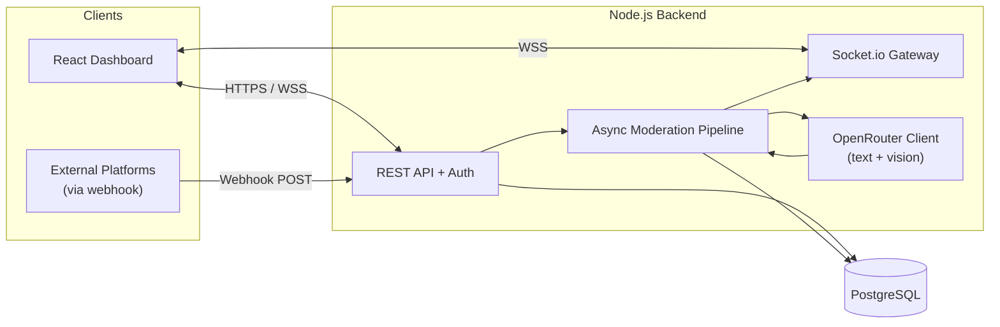

# Community Moderator Platform — Comprehensive Build Plan

## 1. High-Level Architecture



**Flow:** Post created (UI or webhook) → API persists `Post(status=PENDING)` and fires the async moderation pipeline (no broker) → pipeline calls OpenRouter → writes `ModerationResult` and updates `Post.status` → emits WebSocket event → dashboard live-updates the queue.

## 2. Tech Stack

- **Frontend:** React 18 + Vite + TypeScript, TailwindCSS + shadcn/ui (Radix), TanStack Query, Zustand (UI state), React Router v6, Recharts (analytics), Socket.io-client, react-hook-form + zod.
- **Backend:** Node.js 20 + Express + TypeScript, Prisma ORM, Passport (Google/GitHub OAuth), jsonwebtoken, bcrypt, Socket.io, zod (validation), pino (logs), multer + S3-compatible storage for media.
- **AI:** OpenRouter via the `openai` SDK (custom `baseURL`) — single client serves text + vision; model is selected per request through env (`OPENROUTER_MODEL`, e.g. `anthropic/claude-3.5-sonnet` or `openai/gpt-4o`).
- **Infra:** Docker + docker-compose (postgres, api, web), GitHub Actions CI.

## 3. Repository Layout

```
nebula/
├── docker-compose.yml
├── .env.example
├── packages/
│   ├── shared/                  # shared zod schemas + TS types
│   │   └── src/types.ts
│   ├── api/                     # Express backend
│   │   ├── prisma/schema.prisma
│   │   └── src/
│   │       ├── index.ts
│   │       ├── config/env.ts
│   │       ├── middleware/{auth,rbac,error,rateLimit}.ts
│   │       ├── modules/
│   │       │   ├── auth/        # JWT + OAuth (Google/GitHub)
│   │       │   ├── users/
│   │       │   ├── communities/
│   │       │   ├── posts/
│   │       │   ├── moderation/  # queue, decisions, audit
│   │       │   ├── trust/       # reputation deltas
│   │       │   ├── analytics/
│   │       │   └── webhooks/    # external ingestion
│   │       ├── ai/
│   │       │   ├── openrouter.ts  # single OpenRouter client (text + vision)
│   │       │   ├── prompts.ts     # system prompt + JSON schema
│   │       │   └── types.ts       # ModerationOutput type
│   │       ├── pipeline/
│   │       │   └── moderate.ts    # runModeration(postId) + p-limit semaphore
│   │       └── realtime/socket.ts
│   └── web/                     # React frontend
│       └── src/
│           ├── main.tsx, App.tsx, router.tsx
│           ├── lib/{api,socket,auth}.ts
│           ├── components/ui/   # shadcn primitives
│           ├── components/{Layout,Sidebar,Topbar,StatCard,...}
│           └── pages/
│               ├── Login.tsx
│               ├── Dashboard.tsx
│               ├── ModerationQueue.tsx
│               ├── PostReview.tsx
│               ├── CommunitySettings.tsx
│               ├── CommunityRules.tsx
│               ├── Members.tsx
│               ├── TrustScores.tsx
│               ├── Analytics.tsx
│               └── AuditLog.tsx
└── README.md
```

## 4. Database Schema (Prisma)

Key models in `packages/api/prisma/schema.prisma`:

- `User` — id, email, name, avatarUrl, oauthProvider, oauthId, passwordHash?, globalRole (USER/ADMIN), trustScore (Int, default 100), createdAt.
- `Community` — id, slug, name, description, rules (Json: array of `{id,title,description,severity}`), settings (Json: thresholds, autoActions), ownerId.
- `CommunityMember` — userId, communityId, role (USER/MODERATOR/ADMIN), joinedAt. (composite PK)
- `Post` — id, communityId, authorId, externalSource?, externalId?, text, mediaUrls (String[]), status (PENDING/APPROVED/REJECTED/FLAGGED), createdAt.
- `ModerationResult` — id, postId (unique), provider, model, toxicity (Float), sentiment (Float), categories (Json), ruleViolations (Json), recommendation (APPROVE/FLAG/REJECT), reasoning (Text), confidence (Float), latencyMs.
- `ModerationAction` — id, postId, moderatorId, action (APPROVE/REJECT/FLAG/UNFLAG), reason, createdAt.
- `TrustEvent` — id, userId, delta, reason, postId?, createdAt.
- `AuditLog` — id, actorId, action, entityType, entityId, metadata (Json), createdAt.
- `Notification` — id, userId, type, payload (Json), readAt?, createdAt.

Indexes on `Post(communityId,status,createdAt)`, `ModerationResult(postId)`, `AuditLog(actorId,createdAt)`.

## 5. Authentication & RBAC

- **JWT** (15-min access + 7-day refresh in httpOnly cookie). `middleware/auth.ts` verifies and attaches `req.user`.
- **OAuth** via Passport strategies for Google and GitHub; first login auto-creates user, links by email.
- **Roles:** global (`USER`/`ADMIN`) + per-community (`USER`/`MODERATOR`/`ADMIN`).
- `middleware/rbac.ts` exposes `requireCommunityRole('MODERATOR')` checking `CommunityMember`.

## 6. AI Moderation Pipeline

`packages/api/src/ai/openrouter.ts` exposes a single function:

```ts
export async function analyzeContent(input: {
  text: string;
  imageUrls?: string[];
  rules: CommunityRule[];
}): Promise<ModerationOutput>;
```

Implementation: instantiates the `openai` SDK with `baseURL: 'https://openrouter.ai/api/v1'` and `apiKey: OPENROUTER_API_KEY`. Sends one `chat.completions.create` call to `OPENROUTER_MODEL` (default `anthropic/claude-3.5-sonnet`) with a multimodal message — text + each image as `{ type: 'image_url', image_url: { url } }` — and `response_format: { type: 'json_object' }`. The system prompt (in `prompts.ts`) embeds the community rules and demands a strict JSON response matching `ModerationOutput`:

`ModerationOutput` = `{ toxicity, sentiment, categories[], ruleViolations[], recommendation, reasoning, confidence }`.

**Async pipeline** (`packages/api/src/pipeline/moderate.ts`) — no broker, no recovery, no retry logic. One function:

1. The API/webhook controller persists `Post(status=PENDING)`, calls `runModeration(postId)`, and returns the HTTP response immediately (fire-and-forget; errors caught + logged via pino).
2. `runModeration` loads Post + Community.rules and calls `analyzeContent` once (text + images together) through a shared `p-limit(5)` semaphore so a burst of posts can't fan out unbounded calls to OpenRouter.
3. On success: persist `ModerationResult`, apply thresholds (`settings.autoApproveBelow`, `settings.autoRejectAbove`) to set final `Post.status`, append `AuditLog`, insert `TrustEvent`, emit `moderation:update` over Socket.io to `community:{id}`.
4. On failure: log the error and leave the post `PENDING`. Moderators can re-trigger via the existing "Reanalyze" button in the UI (`POST /posts/:id/reanalyze`).

## 7. Backend API Surface (REST)

- `POST /auth/register`, `POST /auth/login`, `POST /auth/refresh`, `POST /auth/logout`
- `GET /auth/oauth/google`, `GET /auth/oauth/github`, `GET /auth/oauth/:provider/callback`
- `GET/POST /communities`, `GET/PATCH /communities/:id`, `GET/PUT /communities/:id/rules`
- `POST /communities/:id/members`, `PATCH /communities/:id/members/:userId` (role)
- `GET /communities/:id/posts?status=PENDING`, `POST /communities/:id/posts`, `GET /posts/:id`
- `POST /posts/:id/actions` (approve/reject/flag) — moderator only
- `POST /posts/:id/reanalyze` — re-runs AI
- `GET /communities/:id/analytics?range=7d` (timeseries: volume, toxicity avg, action mix, response time)
- `GET /communities/:id/trust` (top/bottom users)
- `GET /audit?communityId=&actorId=`
- `POST /webhooks/:communityId/ingest` — HMAC-signed (`X-Signature`), accepts `{externalId, author, text, mediaUrls[]}`.

## 8. Real-Time (Socket.io)

- Auth handshake using JWT. Clients join `community:{id}` rooms based on membership.
- Events: `post:new`, `moderation:update`, `action:taken`, `notification:new`.
- Single-process Socket.io server (no external adapter); the moderation pipeline imports the same `io` instance to emit directly.

## 9. Frontend (Beautiful Dashboard)

- **Design system:** dark/light theme via Tailwind + CSS vars; shadcn/ui primitives (Button, Card, Dialog, Sheet, DataTable, Badge, Toast). Lucide icons. Generous whitespace, soft shadows, rounded-2xl cards, subtle gradient accents on KPI tiles.
- **Layout:** collapsible sidebar (`Sidebar.tsx`) with community switcher, top bar with global search + notification bell (live badge from socket), main content area.
- **Pages:**
  - `Dashboard.tsx` — KPI tiles (Pending, Auto-resolved today, Avg response time, Toxicity trend), Recharts line + stacked bar, recent activity feed.
  - `ModerationQueue.tsx` — virtualized DataTable of pending posts; columns: author (with trust badge), preview, AI scores (color-coded chips), recommendation, actions. Live-updates via socket. Bulk actions.
  - `PostReview.tsx` — split view: original post (text + image gallery) on left; AI reasoning, scores, rule matches, action buttons (Approve/Reject/Flag with reason), full audit timeline on right.
  - `CommunityRules.tsx` — drag-and-drop rules editor (id/title/description/severity), saved as Community.rules JSON.
  - `CommunitySettings.tsx` — thresholds sliders (auto-approve/reject), OpenRouter model selector (free-text or dropdown of common models), webhook URL + secret display + regenerate.
  - `Members.tsx` — invite, role assignment.
  - `TrustScores.tsx` — leaderboard, sparkline per user, trust event log.
  - `Analytics.tsx` — Recharts: post volume, decision distribution donut, toxicity heatmap (hour x day), false-positive rate (when moderators override AI).
  - `AuditLog.tsx` — filterable table.
- **Auth UX:** `Login.tsx` with email/password + Google/GitHub buttons; protected routes; auto-refresh token via Axios interceptor.
- **State:** TanStack Query for server data; Zustand for UI (active community, theme); Socket.io client cache-invalidates queries on events.

## 10. Deployment (Docker)

`docker-compose.yml` services: `postgres`, `api` (Express + Socket.io + in-process moderation), `web` (Vite build served by a tiny Node static server, e.g. `serve` or `vite preview`).

- Multi-stage Dockerfiles for `api` and `web`.
- `.env.example` documents all secrets: `DATABASE_URL`, `JWT_SECRET`, `JWT_REFRESH_SECRET`, `GOOGLE_CLIENT_ID/SECRET`, `GITHUB_CLIENT_ID/SECRET`, `OPENROUTER_API_KEY`, `OPENROUTER_MODEL`, `WEBHOOK_HMAC_SECRET`, `WEB_ORIGIN`.
- The api container exposes both REST and WebSocket on the same port; the web container talks to it directly via `VITE_API_URL`.
- GitHub Actions: lint → typecheck → test → build images → push to GHCR.
- Health endpoints: `/healthz` (api) and `/readyz` (checks DB).

## 11. Testing & Quality

- API: Vitest + supertest for routes, Prisma test DB per run. Unit tests for the OpenRouter client + moderation pipeline using a mocked `openai` client (recorded fixtures).
- Web: Vitest + React Testing Library for components; Playwright smoke test (login → review post → approve).
- Seed script (`prisma/seed.ts`) creates demo admin/moderator/user accounts, two communities with rules, and ~50 sample posts (mix of clean/toxic/borderline) so the dashboard looks alive immediately.

## 12. Build Order (matches todos below)

1. Monorepo + Docker baseline
2. DB schema + migrations + seed
3. Auth (JWT + OAuth) + RBAC
4. Communities, posts, webhook ingestion
5. OpenRouter client + async moderation pipeline
6. Real-time gateway
7. Trust + analytics + audit
8. Frontend shell + design system
9. Moderation queue + post review pages
10. Analytics, trust, settings, audit pages
11. Seed data + Playwright smoke test
12. README + deployment polish